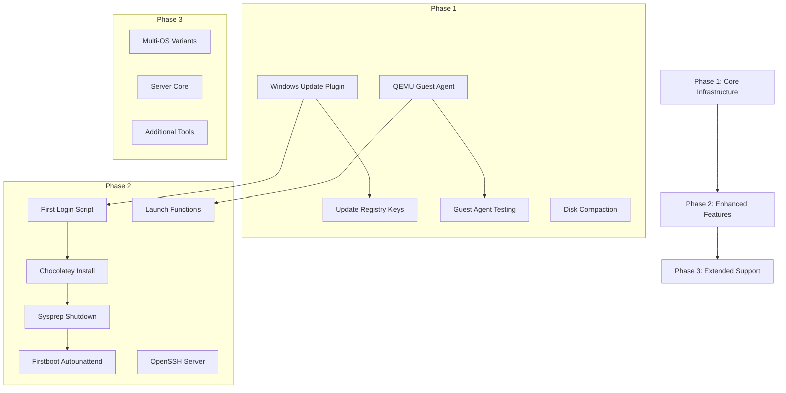

# Feature Porting Analysis: packer-windows → packer-qemu-win11

## Executive Summary

This document provides a comprehensive analysis comparing the deprecated `inspiration/packer-windows` codebase against the current `packer-qemu-win11` repository. The goal is to identify valuable features worth porting to enhance the current implementation.

### Key Findings

| Category | Deprecated Codebase | Current Codebase | Gap |
|----------|---------------------|------------------|-----|
| OS Variants | Multiple Windows versions | Win11 only | out of scope |
| Provisioning Scripts | 6 scripts | 0 scripts | High |
| Build Automation | Comprehensive (build/launch/test) | Basic (build only) | Medium |
| Windows Update | Plugin integrated | Not present | High |
| Testing Infrastructure | QEMU Guest Agent testing | None | High |
| Driver Management | Automated extraction from ISO | Manual download required | Medium |
| Image Optimization | Disk compaction scripts | None | High |
| Sysprep Support | Full with lock file mechanism | Basic shutdown only | Medium |

---

## Category 1: Build Automation Improvements

### 1.1 QEMU Launch Functions

**Feature Description**: Functions to launch built images in QEMU with proper configuration for testing and development.

**Location in Deprecated Code**: [`inspiration/packer-windows/build.sh:18-30`](inspiration/packer-windows/build.sh:18)

```bash
launch_qemu() {
    local image_path="$1"
    local socket_path="$2"
    qemu-system-x86_64 -accel kvm -smp 4 -m 4096 -hda "$image_path" \
        -chardev socket,path="${socket_path}.sock",server=on,wait=off,id=qga0 \
        -device virtio-serial \
        -device virtserialport,chardev=qga0,name=org.qemu.guest_agent.0
}
```

**Integration Approach**:
- Add `launch_win11()` function to current [`build.sh`](build.sh)
- Adapt for UEFI/TPM requirements (add pflash drives, TPM device)
- Include QEMU Guest Agent socket for testing

**Compatibility Considerations**:
- Must add UEFI firmware paths
- Must add TPM device configuration
- Must use virtio-scsi instead of -hda

**Priority**: Medium
**Complexity**: Simple

---


### 1.3 HEADLESS Mode Support

**Feature Description**: Environment variable to control headless mode for CI/CD vs interactive debugging.

**Location in Deprecated Code**: [`inspiration/packer-windows/build.sh:11`](inspiration/packer-windows/build.sh:11)

```bash
HEADLESS="${HEADLESS:-false}"
```

**Integration Approach**:
- Already partially implemented in current [`build.sh`](build.sh) via Packer variable
- Add environment variable passthrough: `packer build -var=headless="${HEADLESS:-false}"`

**Compatibility Considerations**:
- Current [`windows.pkr.hcl`](windows.pkr.hcl:50) already has `headless` variable defined

**Priority**: Low
**Complexity**: Simple

---

## Category 2: Provisioning and Post-Install Capabilities

### 2.1 Windows Update Provisioner Plugin

**Feature Description**: Automated Windows Update installation during image build.

**Location in Deprecated Code**: [`inspiration/packer-windows/win11_23h2.pkr.hcl:8-12`](inspiration/packer-windows/win11_23h2.pkr.hcl:8) and [`inspiration/packer-windows/win11_23h2.pkr.hcl:120-121`](inspiration/packer-windows/win11_23h2.pkr.hcl:120)

```hcl
packer {
  required_plugins {
    windows-update = {
      version = "0.15.0"
      source  = "github.com/rgl/windows-update"
    }
  }
}

build {
  provisioner "windows-update" {
  }
}
```

**Integration Approach**:
1. Add plugin requirement to [`windows.pkr.hcl`](windows.pkr.hcl:1)
2. Add provisioner block in build section
3. Add windows-restart provisioner before windows-update (required for TiWorker.exe issues)

**Compatibility Considerations**:
- Requires registry changes to disable Windows Update sharing (see [`0-firstlogin.bat:44-58`](inspiration/packer-windows/scripts/0-firstlogin.bat:44))
- Significantly increases build time
- May require increased WinRM timeout

**Priority**: High
**Complexity**: Moderate

---

### 2.2 First Login Bootstrap Script

**Feature Description**: Comprehensive first-login script that configures system settings, installs Chocolatey, sets up drivers, and prepares for provisioning.

**Location in Deprecated Code**: [`inspiration/packer-windows/scripts/0-firstlogin.bat`](inspiration/packer-windows/scripts/0-firstlogin.bat)

**Key Capabilities**:
- High performance power mode
- Chocolatey installation
- Network location prompt disable
- Hibernation disable
- Password expiration disable
- RedHat driver certificate trust
- WSUS/Update optimization registry keys
- OpenSSH server installation
- RDP enablement

**Integration Approach**:
1. Create `scripts/` directory in current repo
2. Port script with modifications for current architecture
3. Add to floppy_files in [`windows.pkr.hcl`](windows.pkr.hcl:78)
4. Reference from Autounattend.xml FirstLogonCommands

**Compatibility Considerations**:
- Current Autounattend.xml has inline FirstLogonCommands - would need refactoring
- Some features already implemented inline (execution policy, WinRM)
- Driver certificate path differs (current uses E:\ for VirtIO ISO)

**Priority**: High
**Complexity**: Moderate

---

### 2.3 Network Fix Script

**Feature Description**: PowerShell script to set network connections to Private profile for WinRM.

**Location in Deprecated Code**: [`inspiration/packer-windows/scripts/1-fixnetwork.ps1`](inspiration/packer-windows/scripts/1-fixnetwork.ps1)

```powershell
$networkListManager = [Activator]::CreateInstance([Type]::GetTypeFromCLSID([Guid]"{DCB00C01-570F-4A9B-8D69-199FDBA5723B}"))
$connections = $networkListManager.GetNetworkConnections()
$connections |foreach {
    $_.GetNetwork().SetCategory(1)
}
```

**Integration Approach**:
- Current implementation uses simpler approach in Autounattend.xml:
  ```xml
  <CommandLine>%windir%\System32\WindowsPowerShell\v1.0\powershell.exe -Command Get-NetConnectionProfile | Set-NetConnectionProfile -NetworkCategory "Private"</CommandLine>
  ```
- The deprecated script is more robust for edge cases

**Compatibility Considerations**:
- Current inline approach may be sufficient
- Deprecated approach handles domain-joined scenarios

**Priority**: Low
**Complexity**: Simple

---

### 2.4 WinRM Configuration Script

**Feature Description**: Comprehensive WinRM/Ansible configuration script with SSL certificate generation.

**Location in Deprecated Code**: [`inspiration/packer-windows/scripts/50-enable-winrm.ps1`](inspiration/packer-windows/scripts/50-enable-winrm.ps1)

**Key Capabilities**:
- Self-signed SSL certificate generation
- HTTPS listener configuration
- CredSSP support (optional)
- Firewall rule management
- LocalAccountTokenFilterPolicy configuration
- Connection testing

**Integration Approach**:
- Current implementation uses inline commands in Autounattend.xml
- Port script for more robust configuration
- Useful for post-sysprep re-enablement

**Compatibility Considerations**:
- Current approach uses HTTP only (port 5985)
- Deprecated script supports HTTPS (port 5986)
- Script is also used in Firstboot-Autounattend.xml for post-sysprep

**Priority**: Medium
**Complexity**: Simple

---

### 2.5 QEMU Guest Agent Installation

**Feature Description**: Install QEMU Guest Agent for VM management and testing.

**Location in Deprecated Code**: [`inspiration/packer-windows/scripts/70-install-misc.bat:5`](inspiration/packer-windows/scripts/70-install-misc.bat:5)

```batch
msiexec /qb /i "https://fedorapeople.org/groups/virt/virtio-win/direct-downloads/latest-qemu-ga/qemu-ga-x86_64.msi"
```

**Integration Approach**:
1. Add as provisioner step or FirstLogonCommand
2. Enables guest-exec, guest-ping, guest-get-osinfo commands
3. Required for automated testing infrastructure

**Compatibility Considerations**:
- Requires network access during build
- Could alternatively install from VirtIO ISO

**Priority**: High
**Complexity**: Simple

---

### 2.6 .NET Assembly Compilation

**Feature Description**: Pre-compile .NET assemblies to improve first-run performance.

**Location in Deprecated Code**: [`inspiration/packer-windows/scripts/80-compile-dotnet-assemblies.bat`](inspiration/packer-windows/scripts/80-compile-dotnet-assemblies.bat)

```batch
if exist %windir%\microsoft.net\framework\v4.0.30319\ngen.exe (
    %windir%\microsoft.net\framework\v4.0.30319\ngen.exe update /force /queue
    %windir%\microsoft.net\framework\v4.0.30319\ngen.exe executequeueditems
)
```

**Integration Approach**:
- Add as provisioner step after Windows Update
- Improves application startup times

**Compatibility Considerations**:
- Safe to run, exits gracefully if ngen not present
- Adds build time but improves runtime performance

**Priority**: Low
**Complexity**: Simple

---

### 2.7 Disk Compaction Script

**Feature Description**: Clean up and zero-fill disk for optimal compression.

**Location in Deprecated Code**: [`inspiration/packer-windows/scripts/90-compact.bat`](inspiration/packer-windows/scripts/90-compact.bat)

```batch
net stop wuauserv
rmdir /S /Q C:\Windows\SoftwareDistribution\Download
mkdir C:\Windows\SoftwareDistribution\Download
Dism.exe /online /Cleanup-Image /StartComponentCleanup /ResetBase
choco install sdelete -y
sdelete.exe /accepteula -z c:
```

**Integration Approach**:
1. Add as final provisioner step before shutdown
2. Reduces image size from ~12-15GB to ~8-9GB
3. Requires Chocolatey for sdelete installation

**Compatibility Considerations**:
- Must run after Windows Update
- Significantly increases build time
- Requires Chocolatey to be installed first

**Priority**: High
**Complexity**: Simple

---

## Category 3: Testing Infrastructure

### 3.1 QEMU Guest Agent Testing

**Feature Description**: Automated testing of built images using QEMU Guest Agent.

**Location in Deprecated Code**: [`inspiration/packer-windows/build.sh:36-88`](inspiration/packer-windows/build.sh:36)

```bash
test_ga() {
    local socket_path="$1"
    local expected_os="$2"
    
    # Check if host is alive
    echo '{"execute":"guest-ping"}' | nc -U "$socket_path" -W 1 >/dev/null
    
    # Get OS info
    echo '{"execute":"guest-get-osinfo"}' | nc -U "$socket_path" -W 1 | jq -r ".return"
    
    # Check for lock file (sysprep status)
    pid=$(echo '{"execute":"guest-exec", "arguments": {"path": "cmd.exe", "capture-output":true, "arg": ["/c", "dir", "C:\\not*"]}}' | nc -U "$socket_path" -W 1 | jq .return.pid)
    
    # Check if windeploy.exe is running
    pid=$(echo '{"execute":"guest-exec", "arguments": {"path": "tasklist.exe", "capture-output":true, "arg": []}}' | nc -U "$socket_path" -W 1 | jq .return.pid)
}
```

**Integration Approach**:
1. Add `test_win11()` function to build.sh
2. Requires QEMU Guest Agent to be installed in image
3. Add test commands to build.sh case statement

**Compatibility Considerations**:
- Requires `nc` (netcat) and `jq` on host
- Requires QEMU Guest Agent in image
- Socket path must match launch configuration

**Priority**: High
**Complexity**: Moderate

---

### 3.2 Sysprep Lock File Mechanism

**Feature Description**: Create a lock file during build that is removed after sysprep completes, enabling external systems to verify image readiness.

**Location in Deprecated Code**: 
- Create: [`inspiration/packer-windows/scripts/70-install-misc.bat:14-15`](inspiration/packer-windows/scripts/70-install-misc.bat:14)
- Delete: [`inspiration/packer-windows/answer_files/Firstboot/Firstboot-Autounattend.xml:31-37`](inspiration/packer-windows/answer_files/Firstboot/Firstboot-Autounattend.xml:31)

```batch
REM Create file indicating system is not yet sysprepped
copy C:\windows\system32\cmd.exe C:\not-yet-finished
```

```xml
<RunSynchronousCommand wcm:action="add">
  <Description>Mark box as completed</Description>
  <Path>cmd.exe /c del C:\not-yet-finished</Path>
  <Order>20</Order>
</RunSynchronousCommand>
```

**Integration Approach**:
1. Add lock file creation in provisioning
2. Add Firstboot-Autounattend.xml for post-sysprep configuration
3. Modify shutdown_command to use sysprep

**Compatibility Considerations**:
- Current shutdown uses simple `shutdown /s` command
- Would need to switch to sysprep-based shutdown
- Requires Firstboot-Autounattend.xml to be copied to C:\Windows\Temp

**Priority**: Medium
**Complexity**: Moderate

---

## Category 4: Driver Management

### 4.1 Automated Driver Extraction

**Feature Description**: Extract VirtIO drivers from ISO and prepare for installation.

**Location in Deprecated Code**: [`inspiration/packer-windows/build.sh:93-211`](inspiration/packer-windows/build.sh:93)

```bash
build_drivers() {
    local iso_file=$(find ./iso -maxdepth 1 -name "virtio-win*.iso" -type f | head -n 1)
    7z x "$iso_file" -o"$extract_dir" -y > /dev/null
    local wanted_drivers=("balloon" "NetKVM" "viorng" "vioscsi" "vioserial" "viostor" "cert")
    find "$target_dir" -name "*.pdb" -type f -delete
}
```

**Integration Approach**:
- Current approach uses VirtIO ISO directly via qemuargs
- Deprecated approach extracts to floppy for WinPE driver loading
- Current approach is simpler and works well

**Compatibility Considerations**:
- Current implementation references drivers from E:\ (VirtIO ISO)
- Deprecated implementation uses A:\ (floppy)
- Current approach is preferred for simplicity

**Priority**: Low (current approach is adequate)
**Complexity**: Moderate

---

### 4.2 RedHat Driver Certificate Trust

**Feature Description**: Install RedHat code signing certificate for driver trust.

**Location in Deprecated Code**: [`inspiration/packer-windows/scripts/0-firstlogin.bat:37-39`](inspiration/packer-windows/scripts/0-firstlogin.bat:37)

```batch
certutil -addstore -f "TrustedPublisher" e:\cert\Virtio_Win_Red_Hat_CA.cer
```

**Integration Approach**:
- Add to FirstLogonCommands in Autounattend.xml
- Certificate is on VirtIO ISO at `E:\cert\`

**Priority**: Low
**Complexity**: Simple

---


## Category 6: Sysprep and Image Finalization

### 6.1 Sysprep-Based Shutdown

**Feature Description**: Use sysprep for image generalization instead of simple shutdown.

**Location in Deprecated Code**: [`inspiration/packer-windows/win11_23h2.pkr.hcl:55-58`](inspiration/packer-windows/win11_23h2.pkr.hcl:55)

```hcl
variable "shutdown_command" {
  default = "%WINDIR%/system32/sysprep/sysprep.exe /generalize /oobe /shutdown /unattend:C:/Windows/Temp/Autounattend.xml"
}
```

**Integration Approach**:
1. Create Firstboot-Autounattend.xml for post-sysprep configuration
2. Copy to C:\Windows\Temp during provisioning
3. Change shutdown_command to use sysprep

**Priority**: Medium
**Complexity**: Moderate

---

### 6.2 Firstboot Autounattend

**Feature Description**: Post-sysprep unattended configuration to re-enable WinRM.

**Location in Deprecated Code**: [`inspiration/packer-windows/answer_files/Firstboot/Firstboot-Autounattend.xml`](inspiration/packer-windows/answer_files/Firstboot/Firstboot-Autounattend.xml)

**Key Components**:
- PersistAllDeviceInstalls for driver retention
- WinRM re-enablement after sysprep
- Lock file deletion

**Priority**: Medium
**Complexity**: Moderate

---

## Category 7: Quality of Life Improvements

### 7.1 OpenSSH Server

**Feature Description**: Install and configure OpenSSH server for SSH access.

**Location in Deprecated Code**: [`inspiration/packer-windows/scripts/0-firstlogin.bat:60-67`](inspiration/packer-windows/scripts/0-firstlogin.bat:60)

```batch
powershell -Command "Add-WindowsCapability -Online -Name OpenSSH.Server~~~~0.0.1.0"
powershell -Command "Start-Service sshd"
powershell -Command "Set-Service -Name sshd -StartupType 'Automatic'"
```

**Priority**: Medium
**Complexity**: Simple

---

### 7.2 RDP Enablement

**Feature Description**: Enable Remote Desktop Protocol for GUI access.

**Location in Deprecated Code**: [`inspiration/packer-windows/scripts/0-firstlogin.bat:69-71`](inspiration/packer-windows/scripts/0-firstlogin.bat:69)

```batch
netsh advfirewall firewall add rule name="Open Port 3389" dir=in action=allow protocol=TCP localport=3389
reg add "HKEY_LOCAL_MACHINE\SYSTEM\CurrentControlSet\Control\Terminal Server" /v fDenyTSConnections /t REG_DWORD /d 0 /f
```

**Priority**: Low
**Complexity**: Simple

---

### 7.3 Windows Update Optimization Registry Keys

**Feature Description**: Registry keys to optimize Windows Update behavior during build.

**Location in Deprecated Code**: [`inspiration/packer-windows/scripts/0-firstlogin.bat:44-58`](inspiration/packer-windows/scripts/0-firstlogin.bat:44)

```batch
reg add "HKLM\SOFTWARE\Policies\Microsoft\Windows\DeliveryOptimization" /v DODownloadMode /t REG_DWORD /d 0 /f
reg add "HKLM\Software\Policies\Microsoft\Windows\WindowsUpdate\AU" /v NoAutoUpdate /t REG_DWORD /d 1 /f
```

**Priority**: High (if using windows-update provisioner)
**Complexity**: Simple

---

## Prioritized Implementation Roadmap

### Phase 1: High Priority - Immediate Value

| Feature | Section | Complexity | Impact |
|---------|---------|------------|--------|
| Windows Update Provisioner | 2.1 | Moderate | Security, up-to-date images |
| QEMU Guest Agent | 2.5 | Simple | Testing infrastructure |
| Disk Compaction | 2.7 | Simple | 40% smaller images |
| Guest Agent Testing | 3.1 | Moderate | Automated verification |
| Update Optimization Registry | 7.3 | Simple | Build reliability |

### Phase 2: Medium Priority - Enhanced Functionality

| Feature | Section | Complexity | Impact |
|---------|---------|------------|--------|
| First Login Bootstrap | 2.2 | Moderate | Cleaner provisioning |
| Sysprep Shutdown | 6.1 | Moderate | Proper image generalization |
| Firstboot Autounattend | 6.2 | Moderate | Post-sysprep configuration |
| OpenSSH Server | 7.1 | Simple | Alternative remote access |
| QEMU Launch Functions | 1.1 | Simple | Development workflow |
| Sysprep Lock File | 3.2 | Moderate | Deployment verification |

### Phase 3: Low Priority - Nice to Have

| Feature | Section | Complexity | Impact |
|---------|---------|------------|--------|
| WinRM HTTPS Script | 2.4 | Simple | Enhanced security |
| .NET Compilation | 2.6 | Simple | Runtime performance |
| RDP Enablement | 7.2 | Simple | GUI access |
| Driver Certificate | 4.2 | Simple | Driver updates |
| HEADLESS Mode | 1.3 | Simple | CI/CD flexibility |

---

## Implementation Dependencies



---

## Recommended First Steps

1. **Create scripts directory structure**:
   ```
   scripts/
     0-firstlogin.ps1      # Consolidated bootstrap in PowerShell
     50-enable-winrm.ps1   # WinRM configuration
     90-compact.ps1        # Disk compaction
   ```

2. **Add Windows Update plugin to windows.pkr.hcl**:
   ```hcl
   required_plugins {
     windows-update = {
       version = "0.15.0"
       source  = "github.com/rgl/windows-update"
     }
   }
   ```

3. **Add provisioner blocks**:
   ```hcl
   build {
     provisioner "windows-shell" {
       scripts = ["./scripts/0-firstlogin.ps1"]
     }
     provisioner "windows-restart" {}
     provisioner "windows-update" {}
     provisioner "windows-shell" {
       scripts = ["./scripts/90-compact.ps1"]
     }
   }
   ```

4. **Add QEMU Guest Agent installation**:
   ```hcl
   provisioner "windows-shell" {
     inline = ["msiexec /qb /i https://fedorapeople.org/groups/virt/virtio-win/direct-downloads/latest-qemu-ga/qemu-ga-x86_64.msi"]
   }
   ```

5. **Add launch and test functions to build.sh**

---

## Conclusion

The deprecated `packer-windows` codebase contains several valuable features that would significantly enhance the current `packer-qemu-win11` repository:

1. **Most Impactful**: Windows Update provisioner, disk compaction, and QEMU Guest Agent testing
2. **Best ROI**: Simple features like registry optimization and OpenSSH installation
3. **Future-Proofing**: Multi-OS variant support pattern for expansion

The current codebase has a solid foundation with proper UEFI/TPM/SecureBoot configuration. The recommended approach is to incrementally port features starting with Phase 1 high-priority items, which provide immediate value with relatively low complexity.