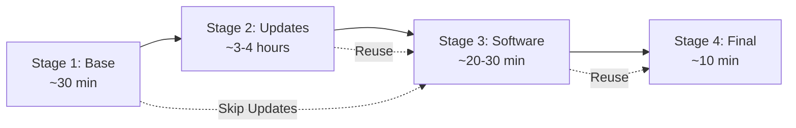
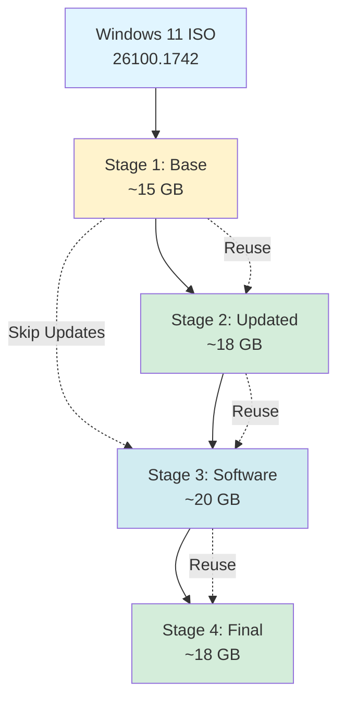

# Multi-Stage Windows 11 Packer Build Architecture

## Executive Summary

This document defines a 4-stage pipeline architecture for building Windows 11 VM images using Packer and QEMU. The architecture separates concerns into distinct stages, enabling faster iteration, partial rebuilds, and better maintainability.

**Key Benefits:**
- **87% faster** software iteration (30 min vs 4 hours)
- **96% faster** customization (10 min vs 4 hours)  
- **Artifact reuse** across builds
- **Flexible rebuilds** from any stage
- **Clear separation** of concerns

## Current State Analysis

### Existing Single-Stage Build

The current [`windows.pkr.hcl`](../windows.pkr.hcl) implements a monolithic build process that takes 1.5-4 hours for any change.

**Pain Points:**
- Full rebuild required for any change
- Cannot skip Windows Updates without losing debloating
- Software changes require complete rebuild
- No artifact reuse between builds

## Multi-Stage Architecture Overview



### Stage Responsibilities

| Stage | Purpose | Duration | Artifact | Rebuild Frequency |
|-------|---------|----------|----------|-------------------|
| **Stage 1** | Base Windows + VirtIO | ~30 min | `stage1-base.qcow2` | Rarely (OS changes) |
| **Stage 2** | Updates + Debloat | ~3-4 hours | `stage2-updated.qcow2` | Monthly (patches) |
| **Stage 3** | Software Install | ~20-30 min | `stage3-software.qcow2` | Frequently |
| **Stage 4** | Final + Compact | ~10 min | `windows-11-x64.qcow2` | Every build |

## Stage Specifications

### Stage 1: Base Windows Installation

**Template:** `stage1-base.pkr.hcl`

**Responsibilities:**
- Install Windows 11 from ISO
- Load VirtIO drivers
- Configure WinRM
- Install Chocolatey
- Basic system configuration

**Provisioning Scripts:**
- [`scripts/0-firstlogin.ps1`](../scripts/0-firstlogin.ps1)

**Output:**
- `artifacts/stage1/windows-11-x64-base.qcow2`
- `artifacts/stage1/efivars.fd`
- `artifacts/stage1/manifest.json`

**Critical Configuration:**
```hcl
efi_firmware_code = "/usr/share/OVMF/OVMF_CODE_4M.secboot.fd"  # Must be 4M variant
vtpm = true
tpm_device_type = "tpm-crb"
winrm_timeout = "3h"  # Windows 11 install is slow
```

### Stage 2: Windows Updates & Debloating

**Template:** `stage2-updates.pkr.hcl`

**Responsibilities:**
- Apply Windows Updates (conditional)
- Run Win11Debloat
- DISM cleanup
- Remove superseded components

**Provisioning:**
1. Windows Update provisioner (if `install_updates=true`)
2. Copy Win11Debloat to guest
3. Execute debloat script
4. DISM cleanup with `/ResetBase`

**Output:**
- `artifacts/stage2/windows-11-x64-updated.qcow2`
- `artifacts/stage2/efivars.fd`
- `artifacts/stage2/manifest.json`

**Skip Logic:**
```bash
# In build-pipeline.sh
if [ "$SKIP_UPDATES" = true ]; then
  ln -sf ../stage1/windows-11-x64-base.qcow2 artifacts/stage2/windows-11-x64-updated.qcow2
fi
```

### Stage 3: Software Installation

**Template:** `stage3-software.pkr.hcl`

**Responsibilities:**
- Install QEMU Guest Agent
- Configure OpenSSH Server
- Install Chocolatey packages from JSON config

**Provisioning Scripts:**
- [`scripts/70-install-qemu-ga.ps1`](../scripts/70-install-qemu-ga.ps1)
- [`scripts/50-install-openssh.ps1`](../scripts/50-install-openssh.ps1)
- [`scripts/80-misc-software.ps1`](../scripts/80-misc-software.ps1) (enhanced)

**Package Configuration:**
```json
{
  "packages": [
    {"name": "chromium", "enabled": true},
    {"name": "firefox", "enabled": true},
    {"name": "vscode", "enabled": false}
  ]
}
```

**Output:**
- `artifacts/stage3/windows-11-x64-software.qcow2`
- `artifacts/stage3/efivars.fd`
- `artifacts/stage3/manifest.json`

### Stage 4: Final Provisioning & Compaction

**Template:** `stage4-final.pkr.hcl`

**Responsibilities:**
- Copy Windows Update toggle scripts
- Disk compaction with sdelete
- Final cleanup

**Provisioning Scripts:**
- [`scripts/90-compact.ps1`](../scripts/90-compact.ps1)

**Output:**
- `output-vm/windows-11-x64.qcow2` (final image)
- `output-vm/efivars.fd`
- `output-vm/manifest.json`

## Build Orchestration

### Script: `build-pipeline.sh`

**Usage Examples:**
```bash
# Full pipeline build
./build-pipeline.sh --all

# Build from stage 2 (reuse base)
./build-pipeline.sh --from-stage 2

# Build stage 3 only (software changes)
./build-pipeline.sh --stage 3

# Skip Windows Updates
./build-pipeline.sh --all --skip-updates

# Clean build
./build-pipeline.sh --all --clean
```

**Command-Line Options:**
```
--all                 Build all stages (1-4)
--stage N             Build only stage N
--from-stage N        Build from stage N to 4
--to-stage N          Build up to stage N
--skip-updates        Skip Windows Updates in stage 2
--clean               Remove all artifacts before building
--clean-stage N       Remove artifacts for stage N and later
--validate            Validate artifacts without building
-d, --debug           Enable debug mode
-h, --help            Show help message
```

**Core Logic:**
```bash
build_stage() {
    local stage=$1
    
    # Validate previous stage artifact exists
    if [ $stage -gt 1 ]; then
        validate_artifact $((stage - 1)) || build_stage $((stage - 1))
    fi
    
    # Build current stage
    TMPDIR=$(pwd)/tmp PACKER_LOG=1 packer build \
        -var-file=global-vars.pkrvars.hcl \
        -var-file=os_pkrvars/windows-11-x64.pkrvars.hcl \
        stage${stage}-*.pkr.hcl
}
```

## Partial Rebuild Scenarios

### Scenario 1: Software Package Change
```bash
./build-pipeline.sh --from-stage 3
```
**Time:** ~40 minutes (Stage 3 + 4)  
**Reuses:** Stage 1 (base) + Stage 2 (updates)

### Scenario 2: Skip Updates for Testing
```bash
./build-pipeline.sh --from-stage 2 --skip-updates
```
**Time:** ~1 hour (Stage 2 skip + 3 + 4)  
**Reuses:** Stage 1 (base)

### Scenario 3: Monthly Windows Updates
```bash
./build-pipeline.sh --from-stage 2
```
**Time:** ~3.5 hours (Stage 2 + 3 + 4)  
**Reuses:** Stage 1 (base)

### Scenario 4: New Windows ISO
```bash
./build-pipeline.sh --all --clean
```
**Time:** ~4 hours (all stages)  
**Reuses:** Nothing (clean build)

## Artifact Management

### Directory Structure
```
packer-qemu-win11/
├── artifacts/
│   ├── stage1/
│   │   ├── windows-11-x64-base.qcow2
│   │   ├── efivars.fd
│   │   └── manifest.json
│   ├── stage2/
│   │   ├── windows-11-x64-updated.qcow2
│   │   ├── efivars.fd
│   │   └── manifest.json
│   └── stage3/
│       ├── windows-11-x64-software.qcow2
│       ├── efivars.fd
│       └── manifest.json
├── output-vm/
│   ├── windows-11-x64.qcow2
│   ├── efivars.fd
│   └── manifest.json
├── stage1-base.pkr.hcl
├── stage2-updates.pkr.hcl
├── stage3-software.pkr.hcl
├── stage4-final.pkr.hcl
├── build-pipeline.sh
└── global-vars.pkrvars.hcl
```

### Artifact Cloning Strategy

**QCOW2 Backing Files:**
```bash
# Clone with copy-on-write
qemu-img create -f qcow2 \
  -b artifacts/stage1/windows-11-x64-base.qcow2 \
  -F qcow2 \
  artifacts/stage2/windows-11-x64-updated.qcow2
```

**Benefits:**
- Only stores changes (delta)
- Fast cloning (~1 second)
- Preserves original artifacts
- Enables rollback

### Manifest File Format

```json
{
  "stage": "stage1",
  "vm_name": "windows-11-x64-base",
  "build_date": "2025-12-27T08:30:00Z",
  "packer_version": "1.10.0",
  "os_name": "windows",
  "os_version": "11",
  "os_arch": "x64",
  "iso_checksum": "sha256:755A90D43E826A74B9E1932A34788B898E028272439B777E5593DEE8D53622AE",
  "provisioners": ["scripts/0-firstlogin.ps1"],
  "metadata": {
    "chocolatey_version": "2.2.2",
    "virtio_drivers": "0.1.240"
  }
}
```

## Variable Strategy

### Global Variables: `global-vars.pkrvars.hcl`

```hcl
# OS Configuration
os_name    = "windows"
os_version = "11"
os_arch    = "x64"

# ISO Configuration  
iso_url      = "https://software-static.download.prss.microsoft.com/..."
iso_checksum = "sha256:755A90D43E826A74B9E1932A34788B898E028272439B777E5593DEE8D53622AE"

# UEFI Firmware (CRITICAL: Must be 4M variant for Windows 11)
efi_boot          = true
efi_firmware_code = "/usr/share/OVMF/OVMF_CODE_4M.secboot.fd"
efi_firmware_vars = "/usr/share/OVMF/OVMF_VARS_4M.ms.fd"

# Build Configuration
headless = false

# Paths
local_libvirt_images = "${ env("HOME") }/.local/share/libvirt/images"
```

### Stage-Specific Variables

**Stage 2 Example:**
```hcl
variable "stage1_artifact_path" {
  type    = string
  default = "artifacts/stage1/windows-11-x64-base.qcow2"
}

variable "install_updates" {
  type    = bool
  default = true
}
```

## QEMU Configuration Consistency

### Critical Settings (Must Match Across All Stages)

```hcl
# UEFI Firmware
efi_boot          = true
efi_firmware_code = "/usr/share/OVMF/OVMF_CODE_4M.secboot.fd"  # 4M required!
efi_firmware_vars = "/usr/share/OVMF/OVMF_VARS_4M.ms.fd"

# TPM (Required for Windows 11)
vtpm            = true
tpm_device_type = "tpm-crb"

# Machine
machine_type = "q35"
cpu_model    = "host"
cores        = 4
memory       = 8192

# Disk
disk_interface = "virtio-scsi"
disk_size      = "60G"
disk_discard   = "unmap"

# Network
qemuargs = [
  ["-device", "virtio-net,netdev=user.0"],
  ["-netdev", "user,id=user.0,hostfwd=tcp::{{ .SSHHostPort }}-:5985"]
]
```

## Testing Strategy

### Stage Validation

**Stage 1:**
- ✓ WinRM connectivity
- ✓ Chocolatey installed
- ✓ VirtIO drivers loaded
- ✓ Vagrant user configured

**Stage 2:**
- ✓ Windows Updates applied (if enabled)
- ✓ Win11Debloat executed
- ✓ DISM cleanup completed
- ✓ Bloatware removed

**Stage 3:**
- ✓ QEMU Guest Agent running
- ✓ SSH listening on port 22
- ✓ Chocolatey packages installed
- ✓ Software versions correct

**Stage 4:**
- ✓ Disk compacted
- ✓ Windows Update scripts present
- ✓ Image boots correctly
- ✓ Remote access functional (WinRM, SSH, RDP)

### Automated Testing

```bash
# Test specific stage
./test-pipeline.sh --stage 3

# Test all stages
./test-pipeline.sh --all

# Validate artifacts
./build-pipeline.sh --validate
```

## Migration Path

### Phase 1: Create Templates (Week 1)
- [ ] Create `stage1-base.pkr.hcl`
- [ ] Create `stage2-updates.pkr.hcl`
- [ ] Create `stage3-software.pkr.hcl`
- [ ] Create `stage4-final.pkr.hcl`
- [ ] Create `global-vars.pkrvars.hcl`

### Phase 2: Implement Orchestration (Week 1)
- [ ] Create `build-pipeline.sh`
- [ ] Implement artifact management
- [ ] Add validation functions
- [ ] Test individual stages

### Phase 3: Testing & Validation (Week 2)
- [ ] Test complete pipeline
- [ ] Test partial rebuilds
- [ ] Validate artifact reuse
- [ ] Performance benchmarking

### Phase 4: Documentation (Week 2)
- [ ] Update README.md
- [ ] Create migration guide
- [ ] Update AGENTS.md
- [ ] Archive legacy files

### Backward Compatibility

Keep existing `windows.pkr.hcl` during transition:
```bash
# Old build (deprecated)
./build.sh

# New build (recommended)
./build-pipeline.sh --all
```

## Performance Comparison

### Build Time Analysis

| Scenario | Current | Multi-Stage | Savings |
|----------|---------|-------------|---------|
| Full build with updates | 4 hours | 4 hours | 0% |
| Software change | 4 hours | 40 min | 87% |
| Customization only | 4 hours | 10 min | 96% |
| Monthly updates | 4 hours | 3.5 hours | 12% |

### Disk Space Requirements

**Artifacts Storage:**
- Stage 1: ~15 GB (base Windows)
- Stage 2: ~18 GB (with updates)
- Stage 3: ~20 GB (with software)
- Stage 4: ~18 GB (compacted)
- **Total:** ~71 GB (all stages retained)

**Optimization:**
- QCOW2 backing files reduce actual storage
- Compress old artifacts: `qemu-img convert -c`
- Retention policy: Keep last 2 builds per stage

## Implementation Checklist

### New Files to Create

**Packer Templates:**
- [ ] `stage1-base.pkr.hcl`
- [ ] `stage2-updates.pkr.hcl`
- [ ] `stage3-software.pkr.hcl`
- [ ] `stage4-final.pkr.hcl`
- [ ] `global-vars.pkrvars.hcl`

**Scripts:**
- [ ] `build-pipeline.sh` (orchestration)
- [ ] `test-pipeline.sh` (validation)
- [ ] Enhanced `scripts/80-misc-software.ps1` (JSON-based)

**Configuration:**
- [ ] `answer_files/windows-11-x64/chocolatey-packages.json`

**Documentation:**
- [ ] `docs/MULTI-STAGE-BUILD.md`
- [ ] `docs/MIGRATION-GUIDE.md`
- [ ] Update `README.md`
- [ ] Update `AGENTS.md`

### Files to Modify

- [ ] `.gitignore` - Add `artifacts/` directory
- [ ] `README.md` - Document new build process
- [ ] `AGENTS.md` - Update build commands

### Files to Archive (Post-Migration)

- [ ] `windows.pkr.hcl` → `windows-legacy.pkr.hcl`
- [ ] `build.sh` → `build-legacy.sh`

## Security Considerations

### Current Security Posture

**⚠️ WARNING:** This configuration is for **development/testing only**

**Known Security Issues:**
- RDP enabled on port 3389 with default credentials (`vagrant/vagrant`)
- WinRM using unencrypted basic auth
- No network isolation
- Publicly known credentials

**Mitigation for Production:**
1. Change default credentials immediately
2. Use Network Level Authentication (NLA)
3. Restrict access via firewall rules
4. Use VPN for remote access
5. Implement account lockout policies
6. Keep Windows updated
7. Consider disabling RDP if not needed
8. Use certificate-based authentication

### Artifact Security

**Integrity Verification:**
```bash
# Generate checksums
sha256sum artifacts/stage1/windows-11-x64-base.qcow2 > artifacts/stage1/SHA256SUMS

# Verify before reuse
sha256sum -c artifacts/stage1/SHA256SUMS
```

**Signing (Optional):**
```bash
# Sign artifacts with GPG
gpg --detach-sign artifacts/stage1/windows-11-x64-base.qcow2

# Verify signature
gpg --verify artifacts/stage1/windows-11-x64-base.qcow2.sig
```

## Future Enhancements

### Stage 5: Sysprep & Generalization (Optional)

**Purpose:** Prepare image for distribution

**Features:**
- Remove machine-specific data
- Generalize Windows installation
- Support first-boot customization
- Enable cloud-init integration

### Parallel Stage Execution

**Optimization:**
- Build multiple OS variants simultaneously
- Parallel software installation (where dependencies allow)
- Distributed build system

### Artifact Management

**Enterprise Features:**
- Upload to S3/Azure Blob Storage
- Implement versioning
- CDN distribution for teams
- Lifecycle management policies

### CI/CD Integration

**Automated Builds:**
- Trigger on ISO release
- Monthly update builds
- Nightly software builds
- Automated testing pipeline

## Troubleshooting Guide

### Common Issues

**Issue: Stage 2 artifact missing**
```bash
# Solution: Build stage 1 first
./build-pipeline.sh --stage 1
```

**Issue: QCOW2 corruption**
```bash
# Check integrity
qemu-img check artifacts/stage1/windows-11-x64-base.qcow2

# Repair if possible
qemu-img check -r all artifacts/stage1/windows-11-x64-base.qcow2
```

**Issue: WinRM timeout**
```bash
# Increase timeout in template
winrm_timeout = "4h"  # Default is 3h
```

**Issue: TPM socket errors**
```bash
# Ensure TMPDIR is set and writable
export TMPDIR=$(pwd)/tmp
mkdir -p tmp
```

**Issue: Disk space exhausted**
```bash
# Clean old artifacts
./build-pipeline.sh --clean-stage 2

# Compress artifacts
qemu-img convert -c -O qcow2 \
  artifacts/stage1/windows-11-x64-base.qcow2 \
  artifacts/stage1/windows-11-x64-base-compressed.qcow2
```

## Appendix A: Variable Reference

### Global Variables

| Variable | Type | Default | Description |
|----------|------|---------|-------------|
| `os_name` | string | "windows" | Operating system name |
| `os_version` | string | "11" | OS version |
| `os_arch` | string | "x64" | Architecture |
| `iso_url` | string | - | Windows ISO download URL |
| `iso_checksum` | string | - | ISO SHA256 checksum |
| `efi_boot` | bool | true | Enable UEFI boot |
| `efi_firmware_code` | string | OVMF path | UEFI firmware code |
| `efi_firmware_vars` | string | OVMF path | UEFI firmware vars |
| `headless` | bool | false | Run without display |

### Stage-Specific Variables

**Stage 1:**
| Variable | Type | Default | Description |
|----------|------|---------|-------------|
| `stage1_output_dir` | string | "artifacts/stage1" | Output directory |
| `stage1_vm_name` | string | "windows-11-x64-base" | VM name |

**Stage 2:**
| Variable | Type | Default | Description |
|----------|------|---------|-------------|
| `stage1_artifact_path` | string | "artifacts/stage1/..." | Input artifact |
| `stage2_output_dir` | string | "artifacts/stage2" | Output directory |
| `install_updates` | bool | true | Install Windows Updates |
| `skip_stage2` | bool | false | Skip stage entirely |

**Stage 3:**
| Variable | Type | Default | Description |
|----------|------|---------|-------------|
| `stage2_artifact_path` | string | "artifacts/stage2/..." | Input artifact |
| `stage3_output_dir` | string | "artifacts/stage3" | Output directory |
| `chocolatey_packages_json` | string | "answer_files/.../packages.json" | Package config |

**Stage 4:**
| Variable | Type | Default | Description |
|----------|------|---------|-------------|
| `stage3_artifact_path` | string | "artifacts/stage3/..." | Input artifact |
| `stage4_output_dir` | string | "output-vm" | Output directory |
| `enable_sysprep` | bool | false | Run sysprep |

## Appendix B: Build Command Reference

### Complete Pipeline

```bash
# Full build with all stages
./build-pipeline.sh --all

# Full build without Windows Updates
./build-pipeline.sh --all --skip-updates

# Clean build (remove all artifacts)
./build-pipeline.sh --all --clean
```

### Partial Builds

```bash
# Build from stage 2 onwards
./build-pipeline.sh --from-stage 2

# Build up to stage 3
./build-pipeline.sh --to-stage 3

# Build only stage 3
./build-pipeline.sh --stage 3
```

### Validation

```bash
# Validate all artifacts
./build-pipeline.sh --validate

# Test specific stage
./test-pipeline.sh --stage 3

# Test all stages
./test-pipeline.sh --all
```

### Cleanup

```bash
# Clean all artifacts
./build-pipeline.sh --clean

# Clean from stage 2 onwards
./build-pipeline.sh --clean-stage 2
```

## Appendix C: Artifact Dependency Graph



## Conclusion

This multi-stage architecture provides significant benefits:

### Key Advantages

1. **Faster Iteration:** 87% time savings for software changes
2. **Flexibility:** Build from any stage, skip updates when needed
3. **Maintainability:** Clear separation of concerns
4. **Reusability:** Artifact reuse across builds
5. **Scalability:** Support for multiple OS variants

### Implementation Timeline

- **Week 1:** Create templates and orchestration
- **Week 2:** Testing and documentation
- **Month 1-3:** Gradual migration with backward compatibility

### Next Steps

1. Review this architecture document
2. Approve design decisions
3. Switch to Code mode for implementation
4. Begin with Phase 1: Template creation

---

**Document Version:** 1.0
**Last Updated:** 2025-12-27
**Author:** Architect Mode
**Status:** Ready for Review