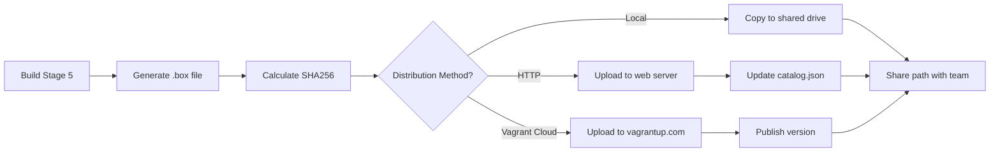

# Vagrant Box Output Architecture for Packer Windows 11 Build

## Executive Summary

This document defines the architecture for converting the Packer-built Windows 11 QEMU images into Vagrant boxes compatible with the `vagrant-libvirt` provider. The design integrates seamlessly with the existing multi-stage build pipeline while also supporting the legacy single-stage build approach.

**Key Benefits:**
- Enables easy distribution of Windows 11 images to colleagues
- Maintains compatibility with existing QEMU/libvirt infrastructure
- Preserves Windows 11 TPM and Secure Boot requirements
- Leverages existing vagrant/vagrant credentials
- Supports both development (fast) and production (complete) builds

---

## 1. Vagrant Box Format for vagrant-libvirt

### 1.1 Box Structure

A vagrant-libvirt box is a compressed tarball (`.box` file) containing:

```
windows-11-x64.box (tarball)
├── metadata.json          # Box metadata (provider, format, virtual_size)
├── Vagrantfile           # Embedded Vagrantfile with provider defaults
└── box.img               # QCOW2 disk image (renamed from windows-11-x64.qcow2)
```

### 1.2 Required Components

#### metadata.json
Defines the box format and provider information:

```json
{
  "provider": "libvirt",
  "format": "qcow2",
  "virtual_size": 60
}
```

**Fields:**
- `provider`: Must be `"libvirt"` for vagrant-libvirt compatibility
- `format`: Disk image format, always `"qcow2"` for this project
- `virtual_size`: Virtual disk size in GB (matches the 60G disk_size variable)

#### Vagrantfile
Embedded configuration that provides defaults for users of the box:

```ruby
Vagrant.configure("2") do |config|
  # Provider-specific configuration
  config.vm.provider :libvirt do |libvirt|
    # Machine type and CPU
    libvirt.machine_type = "q35"
    libvirt.cpu_mode = "host-passthrough"
    
    # Resources
    libvirt.cpus = 2
    libvirt.memory = 4096
    
    # Graphics
    libvirt.graphics_type = "spice"
    libvirt.video_type = "qxl"
    
    # UEFI Firmware (CRITICAL for Windows 11)
    libvirt.loader = "/usr/share/OVMF/OVMF_CODE_4M.secboot.fd"
    libvirt.nvram = "/usr/share/OVMF/OVMF_VARS_4M.ms.fd"
    
    # TPM 2.0 (REQUIRED for Windows 11)
    libvirt.tpm_model = "tpm-crb"
    libvirt.tpm_type = "emulator"
    libvirt.tpm_version = "2.0"
    
    # Disk configuration
    libvirt.disk_bus = "scsi"
    libvirt.disk_device = "sda"
    libvirt.disk_driver :cache => "writeback", :discard => "unmap"
    
    # Network
    libvirt.nic_model_type = "virtio"
  end
  
  # WinRM communicator (default for Windows)
  config.vm.communicator = "winrm"
  config.winrm.username = "vagrant"
  config.winrm.password = "vagrant"
  config.winrm.transport = :plaintext
  config.winrm.basic_auth_only = true
  
  # SSH communicator (alternative, OpenSSH is installed)
  config.ssh.username = "vagrant"
  config.ssh.password = "vagrant"
  config.ssh.insert_key = false
  
  # Network configuration
  config.vm.network :forwarded_port, guest: 3389, host: 33389, id: "rdp", auto_correct: true
  config.vm.network :forwarded_port, guest: 5985, host: 5985, id: "winrm", auto_correct: true
  config.vm.network :forwarded_port, guest: 22, host: 2222, id: "ssh", auto_correct: true
  
  # Synced folders (disabled by default for Windows)
  config.vm.synced_folder ".", "/vagrant", disabled: true
end
```

#### box.img
The QCOW2 disk image renamed from the Packer output. This is the actual VM disk containing the Windows 11 installation.

---

## 2. Packer Post-Processor Configuration

### 2.1 Vagrant Post-Processor

Packer provides a built-in `vagrant` post-processor that supports the libvirt provider. The configuration will be added to the build templates.

#### Configuration Block

```hcl
post-processor "vagrant" {
  compression_level    = 9
  keep_input_artifact = true
  output              = "output-vagrant/${var.os_name}-${var.os_version}-${var.os_arch}.box"
  vagrantfile_template = "templates/vagrantfile.tpl"
  
  # Override provider detection
  provider_override = "libvirt"
}
```

**Parameters:**
- `compression_level`: 9 (maximum compression to reduce box size)
- `keep_input_artifact`: true (preserves the QCOW2 image for direct use)
- `output`: Path to the generated .box file
- `vagrantfile_template`: Path to the Vagrantfile template
- `provider_override`: Forces "libvirt" provider (required for QEMU artifacts)

### 2.2 Vagrantfile Template

The template file (`templates/vagrantfile.tpl`) will use Packer template syntax to inject build-time variables:

```ruby
# -*- mode: ruby -*-
# vi: set ft=ruby :

# Windows 11 Enterprise Evaluation - Vagrant Box
# Built with Packer on {{ isotime "2006-01-02" }}
# OS: {{ .OSName }} {{ .OSVersion }} {{ .OSArch }}

Vagrant.configure("2") do |config|
  config.vm.provider :libvirt do |libvirt|
    libvirt.machine_type = "{{ .MachineType }}"
    libvirt.cpu_mode = "host-passthrough"
    libvirt.cpus = {{ .CPUs }}
    libvirt.memory = {{ .Memory }}
    
    libvirt.graphics_type = "spice"
    libvirt.video_type = "qxl"
    
    # UEFI Secure Boot (4M variant required for Windows 11)
    libvirt.loader = "{{ .EFIFirmwareCode }}"
    libvirt.nvram = "{{ .EFIFirmwareVars }}"
    
    # TPM 2.0 (mandatory for Windows 11)
    libvirt.tpm_model = "tpm-crb"
    libvirt.tpm_type = "emulator"
    libvirt.tpm_version = "2.0"
    
    libvirt.disk_bus = "scsi"
    libvirt.disk_device = "sda"
    libvirt.disk_driver :cache => "writeback", :discard => "unmap"
    libvirt.nic_model_type = "virtio"
  end
  
  config.vm.communicator = "winrm"
  config.winrm.username = "vagrant"
  config.winrm.password = "vagrant"
  config.winrm.transport = :plaintext
  config.winrm.basic_auth_only = true
  config.winrm.timeout = 1800
  
  config.ssh.username = "vagrant"
  config.ssh.password = "vagrant"
  config.ssh.insert_key = false
  
  config.vm.network :forwarded_port, guest: 3389, host: 33389, id: "rdp", auto_correct: true
  config.vm.network :forwarded_port, guest: 5985, host: 5985, id: "winrm", auto_correct: true
  config.vm.network :forwarded_port, guest: 22, host: 2222, id: "ssh", auto_correct: true
  
  config.vm.synced_folder ".", "/vagrant", disabled: true
end
```

---

## 3. Integration with Build Pipeline

### 3.1 Multi-Stage Pipeline Integration

The Vagrant box creation will be added as an **optional post-processing step** after Stage 4 (finalization). This approach:

- Keeps the core build pipeline unchanged
- Allows users to build images without creating Vagrant boxes
- Enables box creation on-demand from existing Stage 4 artifacts

#### Implementation Approach

**Option A: Separate Stage 5 (Recommended)**

Create a new `stage5-vagrant.pkr.hcl` that:
1. Takes the Stage 4 output as input (using `disk_image = true`)
2. Runs no provisioners (just boots to validate)
3. Applies the vagrant post-processor
4. Outputs the .box file

**Benefits:**
- Clean separation of concerns
- Can be run independently: `./build-pipeline.sh --stage 5`
- Doesn't slow down development builds
- Easy to skip for users who don't need Vagrant boxes

**Option B: Post-Processor in Stage 4**

Add the vagrant post-processor directly to [`stage4-finalize.pkr.hcl`](stage4-finalize.pkr.hcl).

**Benefits:**
- Single command produces both QCOW2 and .box
- Simpler for end users

**Drawbacks:**
- Adds time to every Stage 4 build
- Less flexible for development workflows

**Recommendation:** Implement Option A (Stage 5) for maximum flexibility.

### 3.2 Stage 5 Template Structure

```hcl
# stage5-vagrant.pkr.hcl
packer {
  required_version = ">= 1.7.0"
  required_plugins {
    qemu = {
      version = ">= 1.0.7"
      source  = "github.com/hashicorp/qemu"
    }
    vagrant = {
      version = ">= 1.1.0"
      source  = "github.com/hashicorp/vagrant"
    }
  }
}

variable "source_disk" {
  type        = string
  description = "Path to the Stage 4 QCOW2 image"
  default     = "output-stage4/windows-11-x64.qcow2"
}

variable "output_directory" {
  type    = string
  default = "output-vagrant"
}

variable "box_name" {
  type    = string
  default = "windows-11-x64"
}

# Import all other variables from global-vars.pkrvars.hcl
# (os_name, os_version, os_arch, memory, cores, etc.)

source "qemu" "vagrant-box" {
  # Boot from existing Stage 4 image
  disk_image   = true
  iso_url      = var.source_disk
  iso_checksum = "none"
  
  # Use same configuration as Stage 4
  vm_name          = var.box_name
  output_directory = var.output_directory
  
  efi_boot          = var.efi_boot
  efi_firmware_code = var.efi_firmware_code
  efi_firmware_vars = var.efi_firmware_vars
  
  vtpm            = true
  tpm_device_type = "tpm-crb"
  
  machine_type = var.machine_type
  cpu_model    = var.cpu_model
  cores        = var.cores
  memory       = var.memory
  vga          = var.vga
  
  disk_interface = var.disk_interface
  disk_size      = var.disk_size
  disk_discard   = var.disk_discard
  
  # Same qemuargs as Stage 4
  qemuargs = [
    # ... (copy from stage4-finalize.pkr.hcl)
  ]
  
  # Quick boot just to validate
  boot_wait = "30s"
  
  communicator   = "winrm"
  winrm_timeout  = "10m"
  winrm_username = var.winrm_username
  winrm_password = var.winrm_password
  
  # No shutdown needed - we're just validating
  shutdown_command = "shutdown /s /t 10 /f /d p:4:1 /c \"Vagrant Box Creation\""
  shutdown_timeout = "5m"
}

build {
  sources = ["source.qemu.vagrant-box"]
  
  # No provisioners - image is already finalized
  
  post-processor "vagrant" {
    compression_level    = 9
    keep_input_artifact = true
    output              = "${var.output_directory}/${var.os_name}-${var.os_version}-${var.os_arch}.box"
    vagrantfile_template = "templates/vagrantfile.tpl"
    provider_override    = "libvirt"
  }
  
  post-processor "checksum" {
    checksum_types = ["sha256"]
    output         = "${var.output_directory}/${var.os_name}-${var.os_version}-${var.os_arch}.box.sha256"
  }
}
```

### 3.3 Build Pipeline Script Updates

Update [`build-pipeline.sh`](build-pipeline.sh) to support Stage 5:

```bash
# Add Stage 5 configuration
STAGE5_TEMPLATE="stage5-vagrant.pkr.hcl"
STAGE5_VARS="stage5-vars.pkrvars.hcl"
STAGE5_TIME=15  # minutes

# Update END_STAGE default
END_STAGE=5  # or keep at 4 and make 5 opt-in

# Add Stage 5 case to run_stage()
5)
    template="$STAGE5_TEMPLATE"
    vars_file="$STAGE5_VARS"
    stage_name="stage5"
    estimated_time=$STAGE5_TIME
    ;;

# Add Stage 5 to clean functions
# Add Stage 5 to validation functions
```

### 3.4 Single-Stage Build Integration

For the legacy `windows.pkr.hcl` (if it exists), add the post-processor block directly:

```hcl
build {
  sources = ["source.qemu.windows"]
  
  # ... existing provisioners ...
  
  post-processor "vagrant" {
    compression_level    = 9
    keep_input_artifact = true
    output              = "output-vagrant/${var.os_name}-${var.os_version}-${var.os_arch}.box"
    vagrantfile_template = "templates/vagrantfile.tpl"
    provider_override    = "libvirt"
  }
}
```

---

## 4. File Structure

### 4.1 New Files to Create

```
packer-qemu-win11/
├── stage5-vagrant.pkr.hcl          # Stage 5 Packer template
├── stage5-vars.pkrvars.hcl         # Stage 5 variables
├── templates/
│   └── vagrantfile.tpl             # Vagrantfile template for embedding
├── output-vagrant/                 # Output directory for .box files
│   ├── windows-11-x64.box         # Generated Vagrant box
│   └── windows-11-x64.box.sha256  # Checksum file
└── docs/
    └── vagrant-usage.md            # User guide for the Vagrant box
```

### 4.2 Modified Files

- [`build-pipeline.sh`](build-pipeline.sh): Add Stage 5 support
- [`global-vars.pkrvars.hcl`](global-vars.pkrvars.hcl): No changes needed (variables already defined)
- [`README.md`](README.md): Add Vagrant box usage documentation

---

## 5. Vagrantfile Template Design

### 5.1 Template Variables

The Vagrantfile template will use these Packer variables:

| Variable | Source | Example Value |
|----------|--------|---------------|
| `{{ .OSName }}` | `var.os_name` | `windows` |
| `{{ .OSVersion }}` | `var.os_version` | `11` |
| `{{ .OSArch }}` | `var.os_arch` | `x64` |
| `{{ .MachineType }}` | `var.machine_type` | `q35` |
| `{{ .CPUs }}` | `var.cores` | `2` |
| `{{ .Memory }}` | `var.memory` | `4096` |
| `{{ .EFIFirmwareCode }}` | `var.efi_firmware_code` | `/usr/share/OVMF/OVMF_CODE_4M.secboot.fd` |
| `{{ .EFIFirmwareVars }}` | `var.efi_firmware_vars` | `/usr/share/OVMF/OVMF_VARS_4M.ms.fd` |

### 5.2 Critical Configuration Elements

#### TPM 2.0 Configuration
```ruby
libvirt.tpm_model = "tpm-crb"
libvirt.tpm_type = "emulator"
libvirt.tpm_version = "2.0"
```

**Why Critical:** Windows 11 requires TPM 2.0. Without this, the VM will fail to boot or show compatibility errors.

#### UEFI Secure Boot (4M Firmware)
```ruby
libvirt.loader = "/usr/share/OVMF/OVMF_CODE_4M.secboot.fd"
libvirt.nvram = "/usr/share/OVMF/OVMF_VARS_4M.ms.fd"
```

**Why Critical:** Windows 11 requires UEFI Secure Boot. The 4M variant is mandatory (standard OVMF fails the hardware check).

#### VirtIO Drivers
```ruby
libvirt.disk_bus = "scsi"
libvirt.nic_model_type = "virtio"
```

**Why Critical:** Matches the VirtIO drivers installed during Packer build. Changing these will cause boot failures.

### 5.3 User Customization Points

Users can override these settings in their project Vagrantfile:

```ruby
Vagrant.configure("2") do |config|
  config.vm.box = "windows-11-x64"
  
  config.vm.provider :libvirt do |libvirt|
    # Override defaults
    libvirt.cpus = 4
    libvirt.memory = 8192
  end
  
  # Add additional port forwards
  config.vm.network :forwarded_port, guest: 80, host: 8080
end
```

---

## 6. Testing and Validation

### 6.1 Box Creation Validation

After building the Vagrant box, validate its structure:

```bash
# Extract box contents
mkdir -p /tmp/box-test
cd /tmp/box-test
tar -xzf /path/to/windows-11-x64.box

# Verify files exist
ls -lh
# Expected output:
# metadata.json
# Vagrantfile
# box.img

# Validate metadata.json
cat metadata.json | jq .
# Expected output:
# {
#   "provider": "libvirt",
#   "format": "qcow2",
#   "virtual_size": 60
# }

# Validate QCOW2 image
qemu-img info box.img
# Should show:
# - format: qcow2
# - virtual size: 60 GiB
```

### 6.2 Box Import and Launch

```bash
# Add box to Vagrant
vagrant box add --name windows-11-test /path/to/windows-11-x64.box

# Create test directory
mkdir -p ~/vagrant-test/win11
cd ~/vagrant-test/win11

# Initialize Vagrantfile
vagrant init windows-11-test

# Launch VM
vagrant up --provider=libvirt

# Verify WinRM connectivity
vagrant winrm -c "hostname"

# Verify SSH connectivity (alternative)
vagrant ssh -c "hostname"

# Test RDP access
xfreerdp /v:localhost:33389 /u:vagrant /p:vagrant

# Cleanup
vagrant destroy -f
vagrant box remove windows-11-test
```

### 6.3 Automated Testing Script

Create `scripts/test-vagrant-box.sh`:

```bash
#!/bin/bash
set -e

BOX_FILE="$1"
BOX_NAME="windows-11-test-$(date +%s)"
TEST_DIR="/tmp/vagrant-box-test-$$"

echo "Testing Vagrant box: $BOX_FILE"

# Add box
vagrant box add --name "$BOX_NAME" "$BOX_FILE"

# Create test directory
mkdir -p "$TEST_DIR"
cd "$TEST_DIR"

# Initialize
vagrant init "$BOX_NAME"

# Launch
vagrant up --provider=libvirt

# Test WinRM
if vagrant winrm -c "hostname"; then
    echo "✓ WinRM connectivity successful"
else
    echo "✗ WinRM connectivity failed"
    exit 1
fi

# Test SSH
if vagrant ssh -c "hostname"; then
    echo "✓ SSH connectivity successful"
else
    echo "✗ SSH connectivity failed"
    exit 1
fi

# Cleanup
vagrant destroy -f
vagrant box remove "$BOX_NAME"
rm -rf "$TEST_DIR"

echo "✓ All tests passed"
```

---

## 7. Distribution Considerations

### 7.1 Box Hosting Options

#### Option 1: Local File Sharing
- **Method:** Share .box file via network drive, HTTP server, or file transfer
- **Pros:** Simple, no external dependencies, full control
- **Cons:** Manual distribution, no version management
- **Use Case:** Small teams, internal use

```bash
# Add box from local file
vagrant box add --name windows-11-x64 /path/to/windows-11-x64.box

# Add box from HTTP server
vagrant box add --name windows-11-x64 http://fileserver.local/boxes/windows-11-x64.box
```

#### Option 2: Vagrant Cloud (HashiCorp)
- **Method:** Upload to https://app.vagrantup.com/
- **Pros:** Version management, automatic updates, discovery
- **Cons:** Public by default (private boxes require paid account), upload size limits
- **Use Case:** Public distribution, teams using Vagrant Cloud

#### Option 3: Self-Hosted Vagrant Catalog
- **Method:** Host metadata.json catalog on internal web server
- **Pros:** Private, version management, no external dependencies
- **Cons:** Requires web server setup and maintenance
- **Use Case:** Enterprise environments, air-gapped networks

### 7.2 Box Versioning

Create a version catalog (`catalog.json`):

```json
{
  "name": "myorg/windows-11-x64",
  "description": "Windows 11 Enterprise Evaluation with VirtIO drivers",
  "versions": [
    {
      "version": "1.0.0",
      "providers": [
        {
          "name": "libvirt",
          "url": "http://fileserver.local/boxes/windows-11-x64-1.0.0.box",
          "checksum_type": "sha256",
          "checksum": "abc123..."
        }
      ]
    }
  ]
}
```

Usage:
```bash
vagrant box add http://fileserver.local/boxes/catalog.json
```

### 7.3 Box Metadata File

Create `windows-11-x64.json` for version management:

```json
{
  "name": "windows-11-x64",
  "description": "Windows 11 Enterprise Evaluation (x64) with VirtIO drivers, TPM 2.0, and Secure Boot",
  "short_description": "Windows 11 Enterprise Evaluation for libvirt/KVM",
  "versions": [
    {
      "version": "2026.01.0",
      "status": "active",
      "description_html": "<p>Windows 11 Enterprise Evaluation</p><ul><li>VirtIO drivers installed</li><li>TPM 2.0 enabled</li><li>UEFI Secure Boot</li><li>OpenSSH Server</li><li>QEMU Guest Agent</li><li>Debloated with Win11Debloat</li></ul>",
      "description_markdown": "Windows 11 Enterprise Evaluation\n\n- VirtIO drivers installed\n- TPM 2.0 enabled\n- UEFI Secure Boot\n- OpenSSH Server\n- QEMU Guest Agent\n- Debloated with Win11Debloat",
      "providers": [
        {
          "name": "libvirt",
          "url": "file:///path/to/windows-11-x64.box",
          "checksum_type": "sha256",
          "checksum": "CHECKSUM_HERE"
        }
      ]
    }
  ]
}
```

### 7.4 Distribution Workflow



---

## 8. Security Considerations

### 8.1 Known Security Issues

**⚠️ WARNING: This box contains known security vulnerabilities and is intended for development/testing only.**

1. **Default Credentials:** vagrant/vagrant (publicly known)
2. **WinRM Unencrypted:** Basic auth over HTTP (no TLS)
3. **SSH Password Auth:** Enabled with known password
4. **RDP Enabled:** Accessible with default credentials
5. **No Windows Updates:** May be missing security patches (if built with `--skip-updates`)

### 8.2 Hardening Recommendations

For production use, users should:

1. **Change default credentials immediately:**
   ```powershell
   net user vagrant NewSecurePassword123!
   ```

2. **Enable WinRM over HTTPS:**
   ```powershell
   # Configure WinRM HTTPS listener
   winrm quickconfig -transport:https
   ```

3. **Disable password authentication for SSH:**
   ```powershell
   # Use SSH keys instead
   # Edit C:\ProgramData\ssh\sshd_config
   ```

4. **Restrict RDP access:**
   ```powershell
   # Firewall rules to limit RDP to specific IPs
   New-NetFirewallRule -DisplayName "RDP-Restricted" -Direction Inbound -LocalPort 3389 -Protocol TCP -Action Allow -RemoteAddress 192.168.1.0/24
   ```

5. **Install Windows Updates:**
   ```powershell
   # Run Windows Update
   C:\Scripts\WindowsUpdate\Enable-WindowsUpdates.ps1
   Install-WindowsUpdate -AcceptAll -AutoReboot
   ```

### 8.3 Box Metadata Security Notes

Include security warnings in the box description:

```json
{
  "description": "⚠️ DEVELOPMENT ONLY - Contains default vagrant/vagrant credentials. Change password immediately after deployment. Do not use in production without proper hardening.",
  "security_notes": [
    "Default credentials: vagrant/vagrant",
    "WinRM uses unencrypted basic auth",
    "RDP enabled on port 3389",
    "SSH password authentication enabled",
    "May not include latest Windows security updates"
  ]
}
```

---

## 9. Usage Documentation

### 9.1 Quick Start Guide

Create `docs/vagrant-usage.md`:

```markdown
# Windows 11 Vagrant Box - Quick Start Guide

## Prerequisites

- Vagrant >= 2.2.0
- vagrant-libvirt plugin: `vagrant plugin install vagrant-libvirt`
- libvirt/KVM installed and running
- OVMF firmware (4M variant): `/usr/share/OVMF/OVMF_CODE_4M.secboot.fd`

## Installation

### From Local File
```bash
vagrant box add --name windows-11-x64 /path/to/windows-11-x64.box
```

### From HTTP Server
```bash
vagrant box add --name windows-11-x64 http://fileserver.local/boxes/windows-11-x64.box
```

## Usage

### Create New VM
```bash
mkdir my-windows-vm
cd my-windows-vm
vagrant init windows-11-x64
vagrant up --provider=libvirt
```

### Connect to VM

**WinRM (PowerShell):**
```bash
vagrant winrm
```

**SSH:**
```bash
vagrant ssh
```

**RDP:**
```bash
xfreerdp /v:localhost:33389 /u:vagrant /p:vagrant
```

### Customize Resources

Edit `Vagrantfile`:
```ruby
Vagrant.configure("2") do |config|
  config.vm.box = "windows-11-x64"
  
  config.vm.provider :libvirt do |libvirt|
    libvirt.cpus = 4
    libvirt.memory = 8192
  end
end
```

### Cleanup
```bash
vagrant destroy -f
vagrant box remove windows-11-x64
```

## Credentials

- **Username:** vagrant
- **Password:** vagrant

⚠️ **Change these immediately for any non-development use!**

## Troubleshooting

### VM fails to boot
- Verify OVMF 4M firmware is installed: `/usr/share/OVMF/OVMF_CODE_4M.secboot.fd`
- Check libvirt logs: `sudo journalctl -u libvirtd -f`

### WinRM connection fails
- Wait 2-3 minutes after `vagrant up` for Windows to fully boot
- Check port forwarding: `vagrant port`

### TPM errors
- Ensure swtpm is installed: `sudo apt install swtpm swtpm-tools` (Debian/Ubuntu)
- Verify TPM emulator is running: `ps aux | grep swtpm`
```

### 9.2 README Updates

Add to [`README.md`](README.md):

```markdown
## Vagrant Box Output

This project can generate Vagrant boxes for easy distribution and deployment.

### Building Vagrant Box

```bash
# Full pipeline including Vagrant box creation
./build-pipeline.sh

# Or build only the Vagrant box stage (requires Stage 4 artifacts)
./build-pipeline.sh --stage 5
```

### Using the Vagrant Box

See [docs/vagrant-usage.md](docs/vagrant-usage.md) for detailed usage instructions.

Quick start:
```bash
vagrant box add --name windows-11-x64 output-vagrant/windows-11-x64.box
vagrant init windows-11-x64
vagrant up --provider=libvirt
```

### Distribution

The generated `.box` file can be shared with colleagues via:
- Local file sharing
- HTTP/HTTPS server
- Vagrant Cloud (requires account)

See [plans/vagrant-box-architecture.md](plans/vagrant-box-architecture.md) for distribution options.
```

---

## 10. Implementation Roadmap

### Phase 1: Core Infrastructure (Priority: High)
- [ ] Create `templates/vagrantfile.tpl` with proper variable substitution
- [ ] Create `stage5-vagrant.pkr.hcl` template
- [ ] Create `stage5-vars.pkrvars.hcl` variables file
- [ ] Test vagrant post-processor with Stage 4 output

### Phase 2: Build Pipeline Integration (Priority: High)
- [ ] Update [`build-pipeline.sh`](build-pipeline.sh) to support Stage 5
- [ ] Add Stage 5 validation and artifact checks
- [ ] Update cleanup functions for Stage 5 outputs
- [ ] Test full pipeline: `./build-pipeline.sh`

### Phase 3: Testing and Validation (Priority: High)
- [ ] Create `scripts/test-vagrant-box.sh` automated test script
- [ ] Validate box structure (metadata.json, Vagrantfile, box.img)
- [ ] Test box import and VM launch
- [ ] Verify WinRM, SSH, and RDP connectivity
- [ ] Test resource customization (CPU, memory)

### Phase 4: Documentation (Priority: Medium)
- [ ] Create `docs/vagrant-usage.md` user guide
- [ ] Update [`README.md`](README.md) with Vagrant box instructions
- [ ] Document distribution options
- [ ] Add security warnings and hardening guide

### Phase 5: Distribution Setup (Priority: Low)
- [ ] Create box metadata file (`windows-11-x64.json`)
- [ ] Set up version catalog structure
- [ ] Document self-hosted catalog setup
- [ ] Create distribution workflow documentation

### Phase 6: Optional Enhancements (Priority: Low)
- [ ] Add single-stage build support (if `windows.pkr.hcl` exists)
- [ ] Create box versioning automation script
- [ ] Add checksum verification to test script
- [ ] Implement automated box publishing workflow

---

## 11. Alternative Approaches Considered

### 11.1 Manual Box Creation

**Approach:** Use `vagrant package` command on a running VM.

**Pros:**
- No Packer post-processor needed
- Can create boxes from any running VM

**Cons:**
- Manual process, not automated
- Requires VM to be running in Vagrant first
- Doesn't integrate with Packer build pipeline
- Less reproducible

**Decision:** Rejected in favor of Packer post-processor for automation and reproducibility.

### 11.2 Custom Shell Script Post-Processor

**Approach:** Write custom shell script to create .box tarball.

**Pros:**
- Full control over box creation
- Can add custom metadata

**Cons:**
- Reinvents the wheel (Packer already has this)
- More maintenance burden
- Potential for bugs and inconsistencies

**Decision:** Rejected in favor of using Packer's built-in vagrant post-processor.

### 11.3 Separate Box Creation Tool

**Approach:** Create standalone tool (e.g., Python script) to convert QCOW2 to .box.

**Pros:**
- Can be run independently of Packer
- Easier to test and debug

**Cons:**
- Additional tool to maintain
- Doesn't integrate with Packer workflow
- Requires separate documentation

**Decision:** Rejected in favor of integrated Packer post-processor approach.

---

## 12. Known Limitations and Future Work

### 12.1 Current Limitations

1. **OVMF Firmware Path Hardcoded:** The Vagrantfile template uses hardcoded paths to OVMF firmware. Users on different distributions may need to adjust these paths.

2. **No Automatic Version Bumping:** Box version must be manually updated in metadata files.

3. **Large Box Size:** Even with compression level 9, the .box file will be ~15-20 GB due to Windows 11 size.

4. **No Multi-Provider Support:** Only libvirt provider is supported. VirtualBox or VMware would require separate builds.

5. **No Vagrant Cloud Integration:** Automated upload to Vagrant Cloud is not implemented.

### 12.2 Future Enhancements

1. **Dynamic Firmware Path Detection:**
   ```ruby
   # Detect OVMF firmware location
   ovmf_paths = [
     "/usr/share/OVMF/OVMF_CODE_4M.secboot.fd",
     "/usr/share/edk2/x64/OVMF_CODE.4m.fd",
     "/usr/share/qemu/OVMF_CODE_4M.secboot.fd"
   ]
   libvirt.loader = ovmf_paths.find { |p| File.exist?(p) }
   ```

2. **Automated Version Management:**
   - Extract version from git tags
   - Auto-generate changelog
   - Update metadata.json automatically

3. **Box Size Optimization:**
   - Implement QCOW2 compression
   - Use sparse file techniques
   - Investigate virt-sparsify integration

4. **Multi-Provider Support:**
   - Add VirtualBox post-processor
   - Add VMware post-processor
   - Conditional provider selection

5. **Vagrant Cloud Integration:**
   - Automated upload script
   - Version publishing workflow
   - Release notes generation

---

## 13. Conclusion

This architecture provides a comprehensive solution for converting Packer-built Windows 11 QEMU images into distributable Vagrant boxes. The design:

✅ **Maintains Compatibility:** Works with existing QEMU/libvirt infrastructure  
✅ **Preserves Requirements:** Supports Windows 11 TPM and Secure Boot  
✅ **Enables Distribution:** Easy sharing with colleagues via multiple methods  
✅ **Flexible Integration:** Works with both multi-stage and single-stage builds  
✅ **Well-Documented:** Comprehensive guides for building, testing, and using boxes  
✅ **Security-Aware:** Documents known issues and hardening recommendations  

### Next Steps

1. **Review this architecture document** with stakeholders
2. **Implement Phase 1** (Core Infrastructure) to create the basic Vagrant box functionality
3. **Test thoroughly** with the validation scripts
4. **Document usage** for end users
5. **Distribute** to colleagues using chosen method

### Success Criteria

- [ ] Vagrant box builds successfully from Stage 4 output
- [ ] Box imports into Vagrant without errors
- [ ] VM boots and is accessible via WinRM/SSH/RDP
- [ ] TPM 2.0 and Secure Boot are functional
- [ ] Box can be distributed and used by colleagues
- [ ] Documentation is clear and complete

---

## Appendix A: Reference Commands

### Build Commands
```bash
# Full pipeline with Vagrant box
./build-pipeline.sh

# Build only Vagrant box stage
./build-pipeline.sh --stage 5

# Build without Windows Updates
./build-pipeline.sh --skip-updates
```

### Testing Commands
```bash
# Validate box structure
tar -tzf output-vagrant/windows-11-x64.box

# Test box
./scripts/test-vagrant-box.sh output-vagrant/windows-11-x64.box

# Manual test
vagrant box add --name test output-vagrant/windows-11-x64.box
vagrant init test
vagrant up --provider=libvirt
vagrant winrm -c "hostname"
vagrant destroy -f
vagrant box remove test
```

### Distribution Commands
```bash
# Calculate checksum
sha256sum output-vagrant/windows-11-x64.box > output-vagrant/windows-11-x64.box.sha256

# Copy to file server
scp output-vagrant/windows-11-x64.box* fileserver:/var/www/boxes/

# Update catalog
vim catalog.json
scp catalog.json fileserver:/var/www/boxes/
```

---

## Appendix B: Troubleshooting Guide

### Issue: Vagrant post-processor fails with "unexpected EOF"

**Cause:** QCOW2 image is corrupted or incomplete.

**Solution:**
```bash
# Validate QCOW2 image
qemu-img check output-stage4/windows-11-x64.qcow2

# Rebuild Stage 4
./build-pipeline.sh --stage 4
```

### Issue: Box imports but VM fails to boot

**Cause:** Missing OVMF firmware or incorrect firmware path.

**Solution:**
```bash
# Check firmware exists
ls -l /usr/share/OVMF/OVMF_CODE_4M.secboot.fd

# Install OVMF (Debian/Ubuntu)
sudo apt install ovmf

# Install OVMF (Fedora/RHEL)
sudo dnf install edk2-ovmf
```

### Issue: WinRM connection timeout

**Cause:** Windows is still booting or WinRM service not started.

**Solution:**
```bash
# Wait longer (Windows 11 takes 2-3 minutes to boot)
sleep 180

# Check VM console
virsh console <vm-name>

# Check port forwarding
vagrant port
```

### Issue: TPM errors in libvirt logs

**Cause:** swtpm not installed or not running.

**Solution:**
```bash
# Install swtpm (Debian/Ubuntu)
sudo apt install swtpm swtpm-tools

# Install swtpm (Fedora/RHEL)
sudo dnf install swtpm swtpm-tools

# Verify swtpm
which swtpm
```

---

**Document Version:** 1.0  
**Last Updated:** 2026-01-05  
**Author:** Roo (Architect Mode)  
**Status:** Ready for Review
